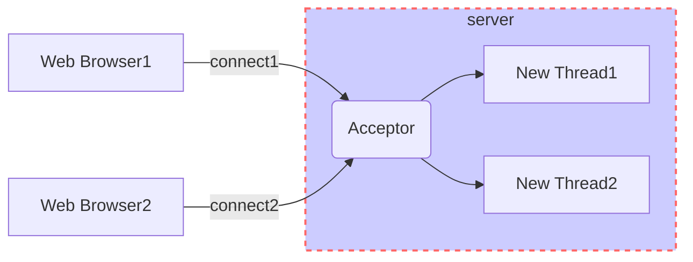
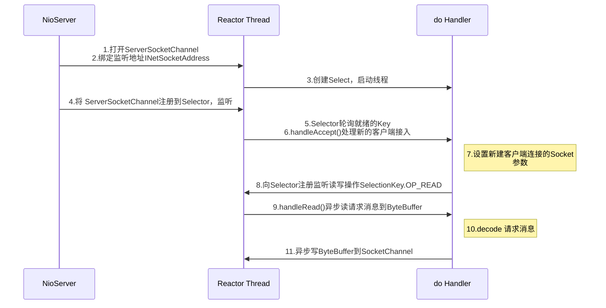

---

---

### 1、NIO入门

#### 1.1、传统的BIO编程

##### 1.1.1、BIO通信模型图

​		采用BIO通信模型的服务端，通常由一个Acceptor线程负责监听客户端的连接，它接收到客户端连接请求后，为每个客户端创建一个新的线程进行链路处理，处理完成之后，通过输出流返回数据给客户端，线程销毁，这个是典型的已请求一应答通信模型。

​	图2-1：

​		缺点：1.缺乏弹性伸缩能力，当客户端并发访问量增加后，服务端的线程个数和客户端并发访问数呈1：1的正比关系，当线程数膨胀之后，系统的i性能将急剧下降，当访问量过大，系统会发生线程溢出、创建新线程失败等问题，最终导致进程宕机或者僵死。

#### 1.2、NIO编程

##### 1.2.1、NIO类库简介

###### 1、缓冲区Buffer

​		Buffer是一个对象，它包含一些要写入或者要读出的数据。

​		在面向流的I/O中，可以将数据直接写入或者将数据直接读到Stream对象中。

​		在NIO库中，所有数据都是用缓冲区处理的。在读取数据时，它时直接读到缓冲区中的；在写入数据时，写入到缓冲区中。热河时候访问NIO中的数据，都是通过缓冲区进行操作。

​		缓冲区实质是一个数组，通常它是一个字节数组（ByteBuffer）,也可以使用其他类型的数组。缓冲区还提供了对数据的结构化访问以及维护读写位子（limit）等信息。

​		每一种Java基本类型（除了Boolean类型）都对应有一种缓冲区，具体如下：

- ByteBuffer：字节缓冲区
- CharBuffer：字符缓冲区
- ShortBuffer：短整型缓冲区
- IntBuffer：整型缓冲区
- LongBuffer：长整型缓冲区
- FloatBuffer：浮点型缓冲区
- DoubleBuffer：双精度浮点型缓冲区

###### 2、通道Channel

​		Channel是一个通道，它就像自来水管一样，网络数据通过Channel读取和写入。通道与流的不同支出在于通道是双向的，流只是在一个方向上移动（一个流必须是InputStream或者OutputStream的子类），而通道可以用于读、写或者二者同时进行。

​		优点：可以比流更好的映射底层操作系统的API。特别是在UNIX网络编程模型中，底层操作系统的通道都是全双工的，同时支持读写操作。实际上Channel可以分为两大类：用于网络读写的SelectableChannel和用于文件操作的FileChannel。ServerSocketChannel和SocketChannel都是SelectableChannel的子类。

###### 3、多路复用器Selector

​		它是Java Nio编程的基础。Selector会不断地轮询注册在其上的Channel，如果某个Channel上面发生读或者写时间，这个Channel就处于就绪状态，会被Selector轮询出来，然后通过SelectionKey可以获取就绪Channel的集合，进行后续的I/O操作。

​	一个多路复用器Selector可以同时轮询多个Channel，JDK使用epoll()代替传统的select实现，所有它并没有最大连接句柄的限制。这意味着，只需要一个线程负责Selector的轮询，就可以接入成千上万的客户端。

##### 1.2.2、NIO服务端序列图

​	NIO服务端序列图如下：

1.2.3、NIO客户端序列图

