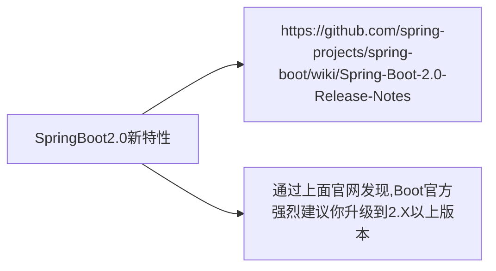

# Spring cloud

## 01.微服务架构概述

### 		什么是微服务？

​		微服务架构师一种架构模式，它提倡将单一应用 程序划分成一组小的服务，服务之间相互协调、互相配合，为用户提供最终价值。每个服务运行在其独立的进程中，服务与服务之间采用轻量级的通信机制相互协作（通常是基于HTTP协议的RESTful API）。每个服务都 围绕着具体业务进行构建，并且能够被独立的部署到生产环境、类生产环境等。另外，应当尽量避免同一的、集中式的服务管理机制，对具体的一个服务而言，应根据业务上下文，选择合适的语言、工具对其进行构建。

​		spring cloud：联合一切，使构建分布式系统更简单，分布式系统里要包含：服务注册与发现、服务调用、服务熔断、负载均衡、服务降级、服务消息队列、配置中心管理、服务网关、服务监控、全链路追踪、自动化构建部署、服务定时任务调度操作。

## 02.SpringCloud简介

###  什么是SpringCloud？

​		SpringCloud=分布式微服务加购的一站式解决方案，是多种微服务加购落地技术的几何体，俗称微服务全家桶。

猜猜SpringCloud这个大集合里有多少种技术？

​		

## 03.SpringCloud技术栈

各个技术栈功能介绍(主流)

SpringCloud 技术对应的功能

版本选择

 springboot版本是以数字作为版本，而SpringCloud以英文大写字母作为版本

SpringBoot版本选择

​	git源码地址 https://github.com/spring-projects/sprnig-boot/releases/

​	springBoot2.0新特性

SpringCloud版本选择

